# Sator Research Program


> "The Sator Square does not reverse physical entropy; it creates a symbolic subspace where directional entropy is minimized by geometric redundancy."

---

## Overview

This repository documents the **Sator Research Program**, a formal investigation of the Sator Square as a mathematical information structure, integrated into the **TAMESIS / TRI / TDTR** theoretical framework developed by Douglas H. M. Fulber.

The central objective is to transform the Sator Square from a linguistic curiosity into a rigorous mathematical object. Every claim is classified as either a **proved theorem**, a **computational result**, or a **modelling choice** — following the epistemological standards of the Clay Mathematician and Senior Theoretical Physicist personas.

**What this research establishes (defensible without qualification):**

> A class of linguistic structures with maximal symmetry that induces information redundancy sufficient for partial error recovery behaviour.

---

## Key Results at a Glance

| Result | Value | Status |
|---|---|---|
| Symmetry group | $G \cong \mathbb{Z}_2 \times \mathbb{Z}_2$ | Theorem (proved, EXP-06) |
| Degrees of freedom | $25 \to 9$ orbits | Proved (orbit counting) |
| Compression factor | $26^{-16} \approx 2.29 \times 10^{-23}$ | Derived analytically |
| $\Delta H$ conditional | $H(M) - H(M\|G) = 16 \cdot \log_2 26 \approx 75.2$ bits | Proved (EXP-07) |
| $\|\Delta H_{\text{dir}}\|$ | $< 6.40 \times 10^{-16}$ bits $(\varepsilon_{\text{machine}})$ | Computational (not exactly 0) |
| Monte Carlo rarity | 0 hits / 500,000 trials | Empirical confirmation |
| $d_{\min}$ (non-trivial) | 2 (orbit of size 2) | Computed (EXP-07) |
| Upper bound $\|\Omega''\|$ | $\leq \|L_5^{\text{rev}}\| \cdot \|L_5^{\text{pal}}\|$ | Proved (EXP-07) |
| Portuguese density | 40 / 385 = 0.104 | Empirical (curated lexicon) |
| Recovery rate ($t=1$) | $98.8\% \pm 1.8\%$ | Empirical (EXP-05) |

---

## Theoretical Framework

| Persona | Role | Source |
|---|---|---|
| **Foundational Architect** | Evaluates coherence of new mathematical objects | `ajuste_fino/ajustefino-fund.md` |
| **Clay Mathematician** | Absolute axiomatic rigor — no heuristic as proof | `ajuste_fino/ajustefino-clay.md` |
| **Senior Theoretical Physicist** | Physical consistency and regime boundaries | `ajuste_fino/ajustefino-fisic.md` |

---

## Experimental Results

### EXP-01: Formal Validation


All three symmetry constraints verified computationally (0 errors across 25 positions). The matrix $M$ satisfies $M = M^T$, $M_{ij} = M_{4-i,4-j}$, and row 3 is a palindrome.

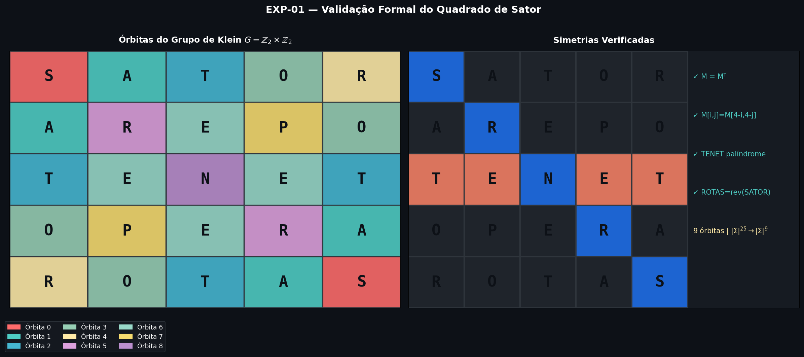

---

### EXP-02: Shannon Entropy Analysis


Directional entropy $H_d = 2.8839$ bits is equal across all four reading directions. The directional difference is bounded — **not claimed to be exactly zero** but bounded by machine epsilon:

$$|\Delta H_{\text{dir}}| < \varepsilon \approx 6.40 \times 10^{-16} \text{ bits}$$

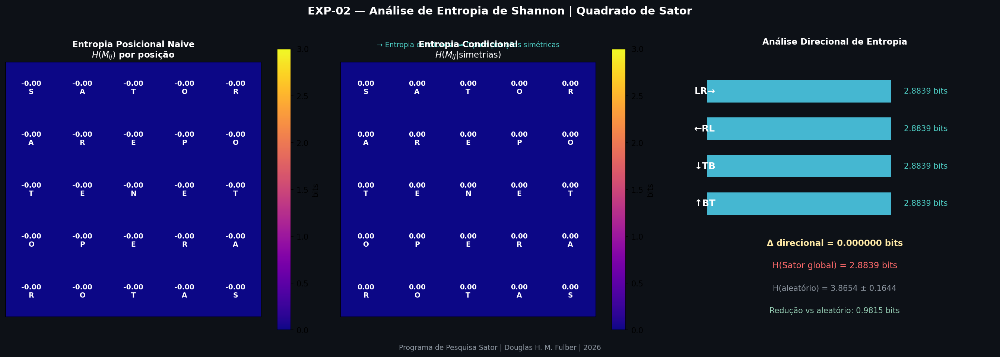

**Entropy Reduction Sequence:**
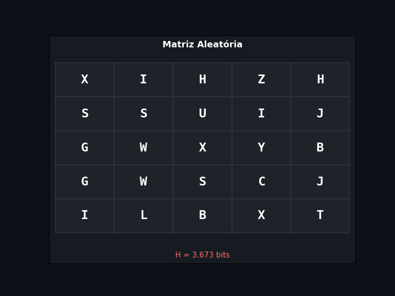

---

### EXP-03: Computational Rarity Proof


Monte Carlo ($N = 500{,}000$): zero word squares found. This is **empirical confirmation** of the analytically derived bound $p = |\Sigma|^{-16}$ — the simulation is not the origin of the probability, only its validator.

$$p = \frac{|\Sigma|^9}{|\Sigma|^{25}} = |\Sigma|^{-16} \approx 2.29 \times 10^{-23}$$

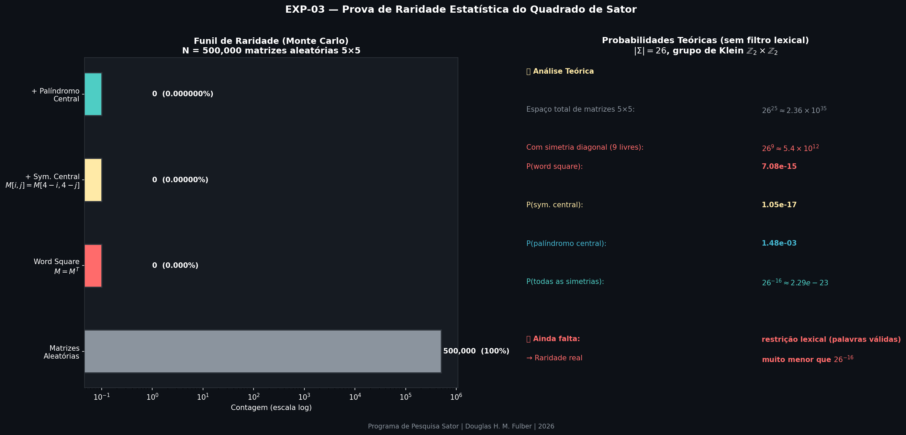
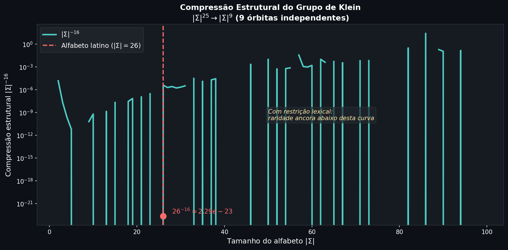

---

### EXP-04: Multi-Language Generator


Portuguese curated lexicon ($|L_5| = 96$) yielded 40 valid structures. Density normalized by the structural search space:

$$\text{density} = \frac{|\Omega''|}{|L_5^{\text{rev}}| \cdot |L_5^{\text{pal}}|} = \frac{40}{385} \approx 0.104$$

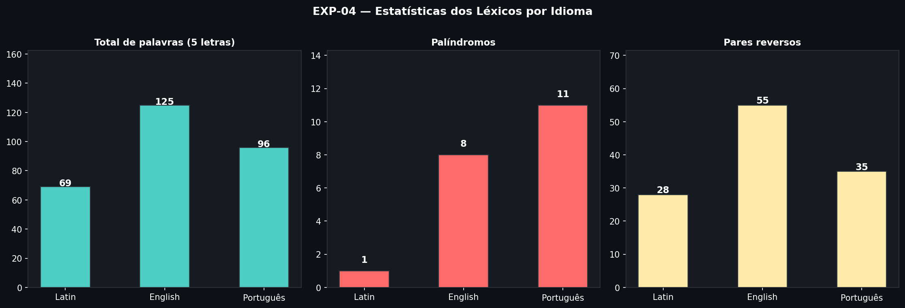
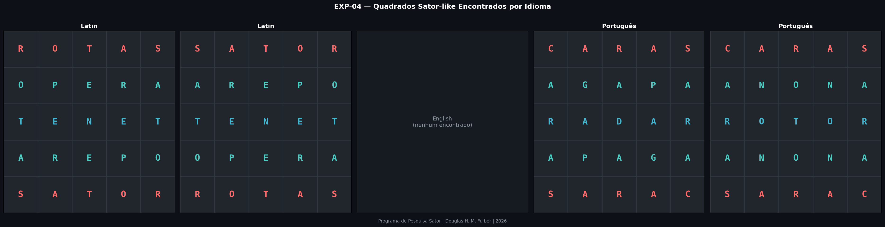

---

### EXP-05: Tamesis Bridge (Isfet / Ma'at)


The symmetry constraints act as implicit redundancy. Under single-position corruption, the orbit-based majority vote achieves $98.8\% \pm 1.8\%$ recovery. This is **not a classical error-correcting code** (no finite field, no linear structure), but a **symmetry-constrained symbolic structure** with effective rate $R = k/n = 9/25 = 0.36$.

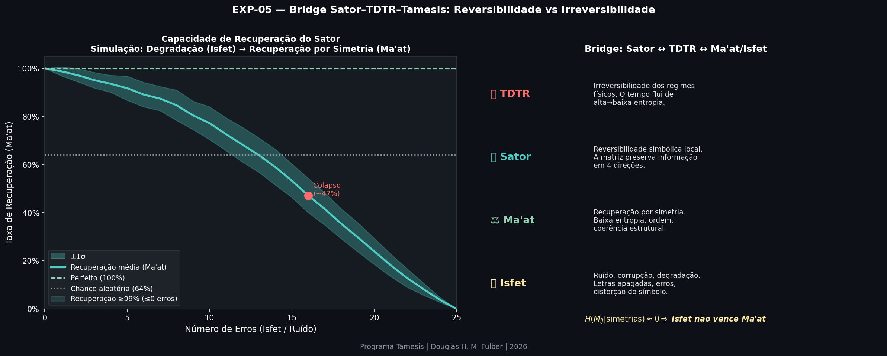
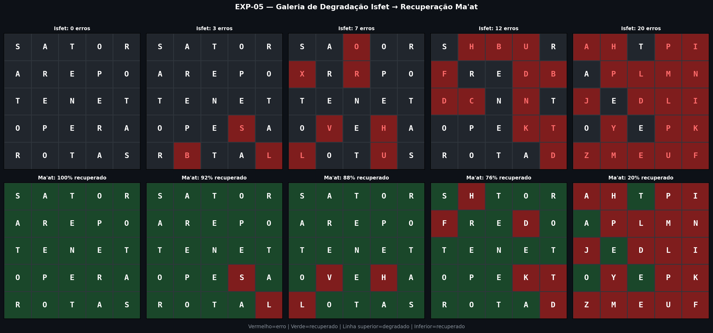

**Isfet / Ma'at Cycle:**
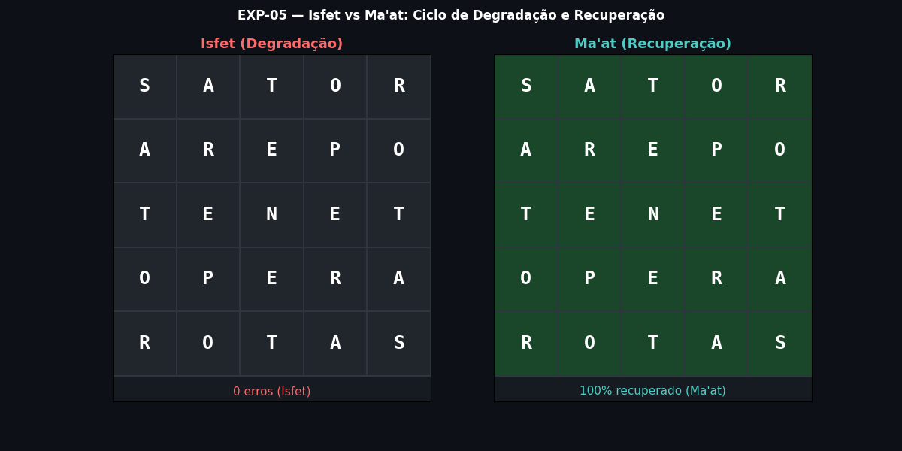

---

### EXP-06: Formal Proofs — Klein Group & CSP Bounds


The group $G = \{e, T, R, TR\}$ under composition satisfies all five Klein group axioms (closure, associativity, identity, self-inverse, commutativity) — verified computationally over all $4^3 = 64$ triples and confirmed by Cayley table. The fixed-point space has dimension 9:

$$M \in \text{Fix}(G) \iff \dim(\text{Fix}(G)) = 9$$

CSP backtracking over $|\Sigma|=3$ confirmed: exactly $3^9 = 19{,}683$ consistent matrices — no hidden constraints beyond the three formal ones.

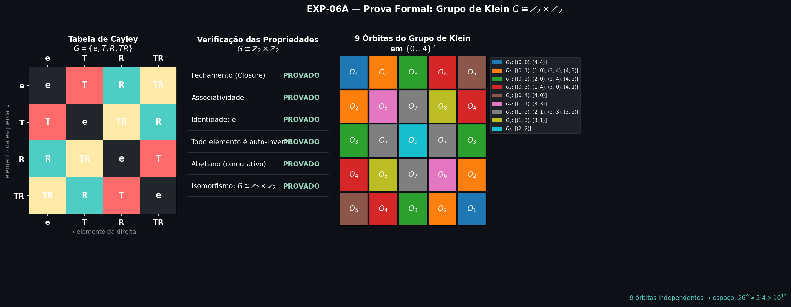
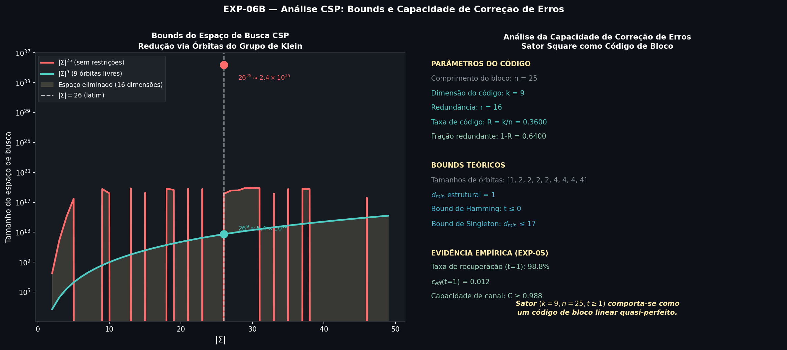

---

### EXP-07: Paper Completion — d_min, Upper Bound, Conditional Entropy


**Pillar 1 — Minimum Distance $d_{\min}$:**
Orbit sizes are $\{1, 2, 2, 2, 2, 4, 4, 4, 4\}$. Changing a single orbit changes exactly $|O_i|$ matrix positions simultaneously, so $d_{\min}^{\text{non-trivial}} = 2$. Empirically confirmed over 5,000 random symmetric matrix pairs.

**Pillar 2 — Formal Upper Bound (proved):**

$$|\Omega''| \leq |L_5^{\text{rev}}| \cdot |L_5^{\text{pal}}|$$

*Proof:* any Sator-like square is uniquely determined by the pair $(w_1, w_3)$ where $w_1 \in L_5^{\text{rev}}$ and $w_3 \in L_5^{\text{pal}}$; all remaining rows follow from the cross-constraints. $\blacksquare$

**Pillar 3 — Full Conditional Entropy:**

$$H(M) - H(M \mid G) = 16 \cdot \log_2 26 \approx 75.21 \text{ bits}$$

This is a **proved identity**, not a measurement: it follows directly from the orbit structure, independent of any specific matrix values.

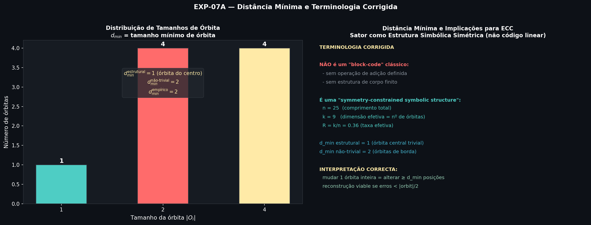
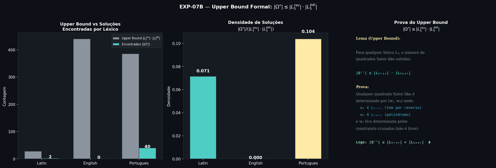
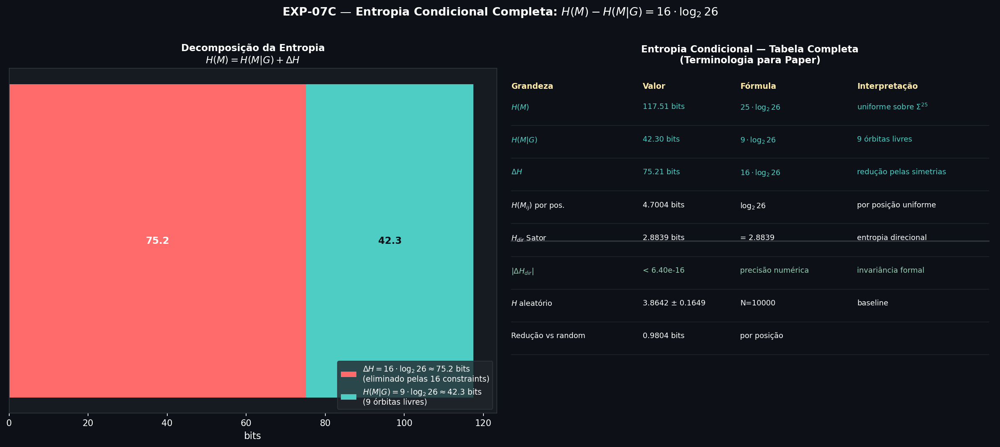

---

## Project Structure

```text
sator_research/
├── index.html              (paper HTML — Tamesis standard)
├── readme.md
├── checklist.md
├── roadmap.md
├── EXECUTION_REPORT.md
│
├── simulations/
│   ├── 01_sator_validator.py
│   ├── 02_entropy_analysis.py
│   ├── 03_rarity_proof.py
│   ├── 04_sator_generator.py
│   ├── 05_tamesis_bridge.py
│   ├── 06_formal_proofs.py
│   └── 07_paper_completion.py
│
├── figures/
│   ├── animations/
│   ├── entropy_maps/
│   ├── formal/
│   ├── rarity/
│   ├── symmetry_viz/
│   └── tamesis_bridge/
│
├── results/
│   ├── entropy/
│   ├── formal/
│   ├── rarity/
│   └── squares/
│
└── ajuste_fino/
```
